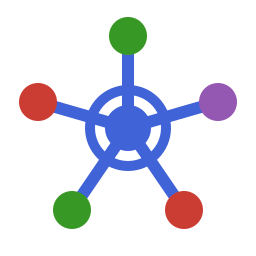

# ERGMEgo.jl


[](https://github.com/statistical-network-analysis-with-Julia/ERGMEgo.jl)
[](https://github.com/statistical-network-analysis-with-Julia/ERGMEgo.jl/actions/workflows/CI.yml?query=branch%3Amain)
[](https://statistical-network-analysis-with-Julia.github.io/ERGMEgo.jl/dev/)
[](https://julialang.org/)
[](https://opensource.org/licenses/MIT)

<p align="center">
  
</p>

ERGMs for egocentrically sampled network data in Julia — a port of the R
`ergm.ego` package (Krivitsky & Morris 2017).

## Installation

Requires Julia 1.12 or newer. The packages are not yet registered.

**Recommended: the ecosystem workspace.** It clones every package side by
side, develops them together in one environment, and adds the packages the
examples also use (CSV, DataFrames, Distributions, Graphs, StatsAPI,
StatsBase):

```bash
mkdir network-analysis && cd network-analysis
git clone https://github.com/statistical-network-analysis-with-Julia/statistical-network-analysis-with-Julia.github.io
julia statistical-network-analysis-with-Julia.github.io/tools/prepare_workspace.jl "$PWD" --clone
julia --project=.snippet-env
```

**Only this package, in your own environment.** Add its dependencies first,
in this order, then the extras the examples below use:

```julia
using Pkg
Pkg.add(url="https://github.com/statistical-network-analysis-with-Julia/NetworkCore.jl")
Pkg.add(url="https://github.com/statistical-network-analysis-with-Julia/ERGM.jl")
Pkg.add(url="https://github.com/statistical-network-analysis-with-Julia/ERGMEgo.jl")
Pkg.add("DataFrames")   # the Quick Start builds its ego data from data frames
```

`Random` is a standard library and needs no install.

## Methodology

Given a sample of egos with their local networks (alters and alter–alter
ties), `ergm_ego`:

1. builds a **pseudo-population network** whose vertex attributes are the
   egos' attributes, each ego replicated `round(ppopsize · wᵢ/Σw)` times
   (`ergm.ego`'s `ppop.wt = "round"`). The realised size can differ from
   the requested `ppopsize` and is what the fit uses and reports; the
   composition does not depend on the order of the egos;
2. computes design-weighted **target statistics** scaled to that size
   (`ego_target_stats`);
3. moves the pseudo-population toward the targets by simulated annealing,
   takes the pseudo-likelihood estimate on it as the start (what R's
   `ergm(target.stats=)` does with `san`), and fits by **MCMC moment
   matching** with ERGM.jl's MCMLE machinery: Hummel-style partial Newton
   steps, and R ergm's **confidence** stopping rule (the moment equations
   must be solved to within a tolerance region with 99 % confidence; the
   sample is enlarged until that can be shown). The sample that passes
   **is** the final sample, so `converged`, `fit.termination`,
   `fit.mcmc_convergence`, `fit.sim_stats` and the standard errors describe
   one draw. A fit that does not converge **warns**, records
   `converged == false`, and says so in `show` and `approximations`;
4. carries `ergm.ego`'s **network-size offset** `netsize.adj` with
   coefficient `−log(ppopsize/popsize)`, so the reported coefficients are
   those of a population of `popsize` members (next section);
5. reports `ergm.ego`'s standard-error decomposition: the **survey-design**
   variance of the targets sandwiched by the inverse information, plus the
   Monte-Carlo **estimation** term of the moment equations,
   `V(θ̂) = I⁻¹ Σ_design I⁻¹ + I⁻¹/n_eff` — `vcov_design` and
   `vcov_estimation` on the result, `vcov(fit)` their sum.

The sampler is ERGM.jl's `mcmle` sampler with R ergm 4's defaults, which
`ergm.ego` runs underneath: SPDyad proposals (`proposal = :spdyad`) and
ESS-adaptive sampling (`effective_size = 64`, R's `MCMLE.effectiveSize`) on
one chain continued from iteration to iteration, so each sample grows until
it carries the effective size the stopping rule needs. The budget scales
with the pseudo-population's dyad count (ERGM.jl's one rule: burn-in
`20·n_dyads`, starting interval `max(100, n_dyads ÷ 10) ÷ 8`, at most
`4·min(3000, 20·ppopsize)` draws); `n_samples`, `burnin`, `interval` and
`maxiter` override it, and `effective_size = nothing` draws a fixed
`n_samples` per iteration (`proposal = :tnt` and `:random` select tie/no-tie
and uniform dyad toggles). Every random draw flows
through the `rng` keyword, so a fit is bit-identical for the same `rng`
state whatever the global RNG holds.

## Population size, per-capita coefficients and the offset

The network-size handling is `ergm.ego`'s:

| You pass | Reported coefficients | `fit.netsize_adjustment` (R's `netsize.adj`) |
|----------|----------------------|----------------------------------------------|
| nothing, and `ed.population_size` is unknown | **per capita** (`popsize = 1`, R's default): the edges coefficient does not depend on `ppopsize`; for a population of `N` members it is `coef − log(N)` | `−log(ppopsize)` |
| `popsize = N` (or `ed.population_size == N`) | those of a network of `N` vertices | `−log(ppopsize/N)`; 0 when `ppopsize == N` |

`simulate_ego_sample` records the size of the network it sampled from, so
its samples are fitted on that scale; pass `popsize = 1` for R's default
output. A model with `EgoTriangle()` carries the offset on
`edges − transitiveties/3` (R's `offset(netsize.adj(edges = 1,
transitiveties = -1/3))`) whenever `ppopsize ≠ popsize`, so its triangle
coefficient is R's, not the triangle coefficient of a plain ERGM on the
pseudo-population. `ego_design(ed; popsize = N)` attaches a population
size to ego data.

`ppopsize` defaults to `ergm.ego`'s choice: `popsize` when it is known and
the number of egos when it is not (with `ergm.ego`'s warning when the
sampling weights are unequal, since rounding `n·wᵢ/Σw` then drops or merges
egos — pass a multiple of the number of egos). One departure: a known
population above 1000 gets ten times the number of egos where R uses the
population itself, because a large pseudo-population is slow (the chain has
to mix over `ppopsize²/2` dyads); `show` and `approximations` say so, and
`ppopsize = popsize` gives R's choice.

## Ego statistics and their ERGM counterparts

| Ego term | Per-ego contribution | Estimates |
|----------|---------------------|-----------|
| `EgoEdges()` | degree/2 | `edges` |
| `EgoNodeMatch(attr)` | matching alters/2 | `nodematch(attr)` |
| `EgoNodeFactor(attr)` | `(1[ego is l]·degree + alters that are l)/2`, per level `l` | `nodefactor(attr)` (first level dropped, as in R) |
| `EgoNodeCov(attr)` | `(x_ego·degree + Σ x_alter)/2` | `nodecov(attr)` |
| `EgoAbsDiff(attr; pow = 1)` | `Σ abs(x_ego − x_alter)^pow / 2` | `absdiff(attr, pow)` |
| `EgoDegree(d)` | `1[degree = d]` | `degree(d)`; R's `degree(0:3)` is `EgoDegree.(0:3)` |
| `EgoTriangle()` | alter–alter ties/3 | `triangle` |
| `EgoGWDegree(decay)` | `e^α(1−(1−e^{−α})^d)`, `decay ≥ 0` | `gwdegree(decay, fixed=TRUE)` (`gwdeg.fixed.<decay>`) |
| `EgoGWESP(decay)` | `Σ_alters w(s)/2`, `s` the alter's degree among the alter–alter ties, `w(s) = e^α(1−(1−e^{−α})^s)` | `gwesp(decay, fixed=TRUE)` (`gwesp.fixed.<decay>`) |
| `EgoESP(k)` | alters whose degree among the alter–alter ties is `k`, halved | `esp(k)` (`esp<k>`); R's `esp(0:3)` is `EgoESP.(0:3)` |
| `EgoMM(attr)` | per cell `(l1, l2)`: alters `a` with `{x_ego, x_a} = {l1, l2}`, halved | `mm(attr)` (`mm[<attr>=<l1>,<attr>=<l2>]`, first cell dropped) |
| `EgoConcurrent()` | `1[degree ≥ 2]` | `concurrent` |

The labels are `ergm.ego`'s: `name(term)`, `coefnames(fit)` and the rows of
`coeftable(fit)` read `edges`, `degree0`, `nodefactor.Race.Hisp`,
`nodematch.Race`, `absdiff.Grade`, `gwdeg.fixed.0.5`, `gwesp.fixed.0`, …, so
a coefficient is found by its R name (`coeftable(fit)["edges"]`). R's first
row, `offset(netsize.adj)`, is `fit.netsize_adjustment` here.

A target at the end of its statistic's attainable range (`degree0` when no
ego is an isolate, `gwesp` when no alter–alter tie is reported) has no
finite coefficient: as `ergm.ego` does, it is fixed at `-Inf` (or `+Inf`)
with ergm's warning, the sampler holds the statistic there, and the other
coefficients are estimated; `drop = false` refuses such a model instead.

With a census ego sample these mappings are exact:
`n · compute(EgoEdges(), ed) == edges(network)`, and likewise for every
term (tested against ERGM.jl's statistics of the network). The targets and
their design covariance equal `ergm.ego`'s on `faux.mesa.high`, and the
`ergm.ego` example model as its help page writes it, `gwesp(0, fixed =
TRUE)` included, fits to `ergm.ego`'s coefficients:

```julia
using ERGMEgo, NetworkCore, Random
net = load_dataset(:faux_mesa_high)
ed = simulate_ego_sample(net, 205; ego_attrs = [:Grade, :Race, :Sex], rng = Xoshiro(1))
# R: ergm.ego(fmh.ego ~ edges + degree(0:3) + nodefactor("Race") + nodematch("Race")
#             + nodefactor("Sex") + nodematch("Sex") + absdiff("Grade")
#             + gwesp(0, fixed = TRUE), popsize = 205)
fit = ergm_ego(ed, [EgoEdges(), EgoDegree.(0:3)..., EgoNodeFactor(:Race), EgoNodeMatch(:Race),
                    EgoNodeFactor(:Sex), EgoNodeMatch(:Sex), EgoAbsDiff(:Grade), EgoGWESP(0.0)];
               se = :design, rng = Xoshiro(1))
fit.converged                         # true
coefnames(fit)[end], coef(fit)[end]   # ("gwesp.fixed.0", ≈ 1.61); ergm.ego: 1.607
```

At the defaults this fit takes about 5–15 seconds (`ergm.ego` takes 24–75
seconds on six of eight seeds and runs past 5 minutes on two): the moment matching
samples as R ergm 4 does underneath `ergm.ego` — SPDyad proposals and
ESS-adaptive sampling on a chain continued between iterations — so the
sample grows exactly as far as the equivalence stopping rule needs.

## Quick Start

```julia
using ERGMEgo, DataFrames, Random

# A survey of six egos: one row per ego, one per ego–alter nomination, one
# per tie among an ego's alters. Egos and alters share one ID space.
ego_df   = DataFrame(ego_id = 1:6, group = ["A", "B", "A", "B", "A", "B"])
alter_df = DataFrame(ego_id   = [1, 1, 2, 3, 3, 4, 5, 6, 6],
                     alter_id = [2, 3, 1, 1, 6, 9, 9, 3, 8],
                     group    = ["B", "A", "A", "A", "B", "A", "A", "A", "B"])
aatie_df = DataFrame(ego_id = [1], src = [2], dst = [3])

ed = as_egodata(ego_df, alter_df; aatie_df = aatie_df,
                ego_attrs = [:group], alter_attrs = [:group])
summary_stats(ed).mean_degree                     # 1.5

# Fit an egocentric ERGM on a pseudo-population of 60 (ten copies of each
# ego). The population size is unknown, so the coefficients are per capita
# (ergm.ego's default, popsize = 1). fit_ergm_ego is the standardized entry
# point; ergm_ego is the same function under ergm.ego's name.
fit = ergm_ego(ed, [EgoEdges(), EgoNodeMatch(:group)]; ppopsize = 60, rng = Xoshiro(1))
fit.converged                                     # true
coef(fit)                                         # per-capita edges, nodematch.group

# Goodness of fit: gof.ergm.ego's three diagnostics — every model statistic
# per capita, the degree distribution, the edgewise-shared-partner
# distribution — plus the mean degree and mean alter–alter ties. The
# simulated ego samples carry the observed sampling weights.
g = gof(fit; n_sim = 50, rng = Xoshiro(1))
[s.name for s in g.statistics]   # ["model statistics", "degree distribution", "edgewise shared partners", "ego summary statistics"]
g.statistics[1].labels                            # ["edges", "nodematch.group"]

# Population size estimation
estimate_popsize(ed)                              # 6.0 — Horvitz–Thompson: the weight sum
estimate_popsize(ed; method = :capture_recapture) # 7.875 — 9 nominations, 6 of them of sampled egos
```

Six egos make a toy: the standard errors of such a fit are wide, and they
are `ergm.ego`'s (see "Known limitations" for what they do not cover).

## Simulating ego samples

`simulate_ego_sample` is the ecosystem's `Network → EgoData` conversion
adapter, and it follows the shared conversion and missing-data contracts:

```julia
using ERGMEgo, NetworkCore, Random

net = load_dataset(:faux_mesa_high)                    # undirected; :Grade, :Race, :Sex
ed = simulate_ego_sample(net, 30; ego_attrs = [:Grade], rng = Xoshiro(1))
ed                                                     # EgoData{Int64}: 30 egos, weighted mean degree …

# What the conversion dropped, named (the conversion contract)
ed, rep = simulate_ego_sample(net, 30; ego_attrs = [:Grade], rng = Xoshiro(1), report = true)
dropped_fields(rep)            # [:edges, :vertex_attrs, :vertex_attrs] — unsampled ties, :Race, :Sex
census, rep = simulate_ego_sample(net, 205; ego_attrs = [:Grade, :Race, :Sex], report = true)
is_lossless(rep)               # true

# Masked (unobserved) dyads are refused unless asked for in writing:
# `simulate_ego_sample(masked, 30)` throws the shared ecosystem ArgumentError
# whose bullets name the opt-in, `missing = :face`
masked = copy(net)
set_missing_dyad!(masked, 1, 2)
ed, rep = simulate_ego_sample(masked, 30; missing = :face, report = true)
:missing_dyads in dropped_fields(rep)                  # true
supports_missing(simulate_ego_sample), missing_policies(simulate_ego_sample)   # (true, (:error, :face))
```

Refused with an `ArgumentError` that says what to do instead: a masked
network under the default `missing = :error`, a **directed** network (ego
networks are undirected; symmetrise first), a **two-mode** network, and an
`ego_attrs` entry the network does not carry, or carries for only some
vertices — the pre-0.2 code silently filled `missing`, which a homophily
term then miscounted. Alter IDs are the network's vertex IDs — the same ID
space as the egos — which is what `estimate_popsize(ed; method =
:capture_recapture)` needs.

**Missing dyads.** A masked dyad is *unobserved*, not absent, and an ego
sample would record its stored face value as an observed ego–alter or
alter–alter tie. `simulate_ego_sample` therefore refuses a masked network
(`missing = :error`, the default; the message names the masked count and
the opt-in) and reads the face values only when asked in writing with
`missing = :face`, recording the number of face-read dyads under
`:missing_dyads` in the `ConversionReport` that `report = true` returns.
`supports_missing(simulate_ego_sample) == true` and
`missing_policies(simulate_ego_sample) == (:error, :face)` declare exactly
that. `fit_ergm_ego` itself takes `EgoData` and never sees a mask — the
egos are a sample of reported local networks, not a sociomatrix — so the
missing-dyad question arises only at the adapter.

## Convergence, standard errors and the StatsAPI surface

A census of statnet's `faux.mesa.high` (bundled as a NetworkCore.jl teaching
dataset) reproduces `ergm.ego`'s fit. Four golden fixtures in
`test/fixtures/` pin the package against R (`ergm.ego` 1.1.4):

- the **census** (unit weights), where the targets and their design
  variance are the network's own and are asserted exactly;
- a **weighted sub-design** (every third actor, case weights `Grade − 6`):
  the Hájek targets of `edges`, `nodematch`, `gwdegree(0.5)` and `triangle`,
  the design variance of a weighted mean, the pseudo-population's
  composition, the exact information at R's estimate, and a weighted fit;
- **network-size handling**: the offset statistic
  `edges − transitiveties/3`, an `edges + triangle` model under
  `popsize = ppopsize`, `popsize = 2·ppopsize` and R's default `popsize = 1`
  (the triangle coefficient is 0.08, 0.65 and −4.19 respectively), a
  weighted `gwdegree` fit, per-capita coefficients at two pseudo-population
  sizes, and `popsize = 2050` with a 508-vertex pseudo-population;
- the **attribute, degree and shared-partner terms**: the targets of
  `nodefactor`, `nodecov`, `absdiff`, `degree` and `gwesp` (census and
  weighted sub-design, with R's labels and the design covariance), the
  `ergm.ego` example model without `gwesp`, `edges + nodematch + gwesp(0)`
  on the census, a per-capita `gwesp` model under the network-size offset,
  a target at its bound (`degree0` on the census without isolates: `-Inf`,
  as in R), and R's default pseudo-population size when the population
  size is unknown. Every Monte-Carlo band is derived from `ergm.ego`'s own
  seed-to-seed spread.

```julia
using ERGMEgo, NetworkCore, Random

net = load_dataset(:faux_mesa_high)                   # 205 students, 203 ties
ed = simulate_ego_sample(net, 205; ego_attrs = [:Grade], rng = Xoshiro(1))
fit = fit_ergm_ego(ed, [EgoEdges(), EgoNodeMatch(:Grade)]; rng = Xoshiro(1))

fit.converged                        # true
fit.termination                      # (rule = :confidence, p_value, precision, confidence, n_samples, step)
fit.mcmc_convergence                 # (iterations, step_length, t_ratios, hotelling_p, n_eff)
coef(fit)                            # ≈ [-6.03, 2.83]: ergm.ego with popsize = 205
stderror(fit)                        # ≈ [0.22, 0.25]: se = :superpopulation, the default when popsize is known
sqrt.(vcov(fit)[1, 1])               # = stderror(fit)[1]
fit.vcov_design                      # ergm.ego's vcov(fit, sources = "model")
fit.vcov_estimation                  # ergm.ego's vcov(fit, sources = "estimation")
coeftable(fit)["edges"]              # the printed row, by its R label
confint(fit)                         # normal-theory 95 % intervals
nobs(fit), dof(fit)                  # (205, 2): egos, finite coefficients
approximations(fit)                  # what the numbers do and do not account for

# R's default output (popsize = 1): per-capita edges, netsize.adj = -log(205)
percap = fit_ergm_ego(ed, [EgoEdges(), EgoNodeMatch(:Grade)];
                      popsize = 1, ppopsize = 205, rng = Xoshiro(1))
coef(percap)[1], percap.netsize_adjustment   # (≈ -0.71, -5.323)

# ergm.ego's standard errors, which treat the egos as independent
r = fit_ergm_ego(ed, [EgoEdges(), EgoNodeMatch(:Grade)]; se = :design, rng = Xoshiro(1))
stderror(r)                          # ≈ [0.16, 0.18] (ergm.ego: 0.178, 0.196 — Monte-Carlo noise in I on both sides)
stderror(fit) ./ stderror(r)         # ≈ [1.41, 1.41]: 1 + n_egos/popsize = 2 at a census
```

`coef`, `stderror`, `vcov`, `confint`, `coeftable` (a
`NetworkCore.CoefficientTable` — the table `show(fit)` prints), `nobs` (the
number of egos; R's `nobs()` on the underlying `ergm` object counts
pseudo-population dyads) and `dof` are defined. `loglikelihood`, `aic` and
`bic` deliberately have **no** methods: the fit is moment matching
(`objective(fit) == :moment`) and no likelihood is ever evaluated. An
unconverged fit (a chain too short to mix, a degenerate model) is loud — a
warning with the termination test, the max t-ratio, Hotelling p-value and
iteration count, the same sentence under `Converged: false` in `show`, and
an entry in `approximations(fit)`.

**How far to trust the standard errors.** `ergm.ego`'s standard errors
(`se = :design`) treat the egos as independent draws. They are not — a tie
between two sampled egos is reported by both — so against the model
parameter they under-cover as the sampling fraction `f = n_egos/popsize`
grows. `se = :superpopulation` multiplies the design component by `1 + f`,
the exact correction for tie-sum statistics (edges, nodematch) under
equal-probability sampling. **It is the default whenever the population
size is known**; when it is not, `f` is unknown and the default is
`se = :design` (`show` says which was used, and what it does not cover).
Pass `se = :design` to reproduce R.

Coverage of nominal 95 % intervals for `edges` / `nodematch`, simulated on
a 200-actor population (300 replicates per row; the test suite reproduces
the census and the 50-ego rows on smaller budgets):

| egos (sampling fraction) | `se = :design` (`ergm.ego`) | `se = :superpopulation` |
|---|---|---|
| 200 (1.0) | 0.80 / 0.83 | 0.94 / 0.95 |
| 100 (0.5) | 0.86 / 0.85 | 0.92 / 0.92 |
| 50 (0.25) | 0.91 / 0.87 | 0.93 / 0.91 |
| 20 (0.1) | 0.85 / 0.78 | 0.87 / 0.78 |
| 100 of 1000 actors (0.1), mean degree 70 | 0.93 / 0.84 | 0.94 / 0.85 |

The correction removes the under-coverage that comes from the
double-counted ties. What remains affects attribute terms: the attribute
composition of the pseudo-population is itself estimated from the sample —
a second-order effect no sandwich captures. It matters with few egos (where
`nodematch` is also biased slightly downward) and when the egos have many
ties (last row). With the composition held at its population value, the
20-ego intervals cover 0.94 / 0.93. The correction is approximate for unequal
weights and for triangle and degree statistics.

**`se = :bootstrap`** covers what the sandwich misses: it resamples the
egos with replacement (each keeping its sampling weight), rebuilds the
pseudo-population and the targets, and refits, `n_boot` times (default
100), through the shared `NetworkCore.bootstrap_cov` loop; every resample and
refit seed is drawn from `rng` up front, so the result does not depend on
the thread count. The standard errors are the replicates' normalised
interquartile ranges (`IQR/1.349`) with their correlations, plus
`n_egos/popsize` times the design sandwich when the population size is
known. A refit that fails is a `NaN` row of `fit.boot_replicates`,
excluded, warned about once and listed by `approximations(fit)`. On the
hard cases it is calibrated or conservative where the default is not:

| design | `se = :superpopulation` | `se = :bootstrap` |
|---|---|---|
| 20 of 200 egos, mean degree 14 (two runs, 150 and 100 replicates) | 0.85 / 0.80–0.84 | 0.94–0.97 / 0.98 |
| 50 of 200 egos, mean degree 56 (80 replicates) | 0.89 / 0.84 | 0.98 / 0.99 |

It costs `n_boot` fits, so it is not the default; `show` recommends it
when there are fewer than 50 egos. The test suite pins the comparison on a
smaller case (10 of 40 egos, mean degree 12).

## Actionable errors

The classic mistakes fail early, with the fix in the message, instead of
producing a number:

| Mistake | What happens |
|---------|--------------|
| `EgoNodeMatch(:x)` on data whose egos or alters lack `:x` | `ArgumentError` naming the attribute, the ego and the side that lacks it — from `compute`, `ego_target_stats` and `fit_ergm_ego` (before any MCMC). The pre-0.2 code scored the ego as 0. |
| `EgoNodeMatch(:x)` (or `ego_mixing_matrix`) where an ego's or an alter's `:x` is `missing` — an unknown alter attribute from a survey, passed through by `as_egodata` | `ArgumentError` naming the attribute, the ego and how many of its alters have no value, with the fix (drop those alters, recode, or drop the term); it used to be a `TypeError` from inside the matching loop. |
| `ego_mixing_matrix(ed, :x)` with an ego lacking `:x` | `ArgumentError` (it used to skip the ego silently). |
| `as_egodata(…; ego_attrs = [:x])`, or any other column keyword, naming a column its frame lacks | `ArgumentError` naming the column, the keyword, the frame and the columns the frame has. |
| `simulate_ego_sample` on a directed, two-mode or masked network, or with an unknown/partial `ego_attrs` entry | `ArgumentError` (see above); `missing = :face` is the written opt-in for masked dyads. |
| `fit_ergm_ego(…; ppopsize = 1)`, or a pseudo-population that comes out below 5 vertices | `ArgumentError` naming the size, where it came from (the keyword, or the default rule with the numbers it saw) and the fix `ppopsize=<n> ≥ 5`. |
| `summary_stats` on an `EgoData` with no egos (an ego frame that filtered to zero rows) | `ArgumentError` saying so, not `mean`'s "reducing over an empty collection". |
| A sampling weight that is `NaN`, `Inf` or negative (an `NA` inclusion probability, a `1/0`), or weights that sum to zero — through `EgoData`, `ego_design(…; weights)` or `as_egodata(…; weight_col)` | `ArgumentError` from the `EgoData` constructor naming the ego (index and id) and the value, before any statistic is computed. A single zero weight is legal. |
| An ego listing the same alter twice (a duplicated `(ego, alter)` row from a wide-to-long reshape), or an alter tied to itself (a `true` on the diagonal of `alter_ties`, or an `aatie_df` row `(ego, a, a)`) | `ArgumentError` from `EgoNetwork` naming the ego and the alter; `as_egodata` says how many duplicate rows and which alter. So are an ego listed as its own alter and an alter attribute with the wrong number of values. |
| `estimate_popsize(ed; method = :lincoln_petersen)` | `ArgumentError` naming the unknown method and the two valid ones, `:horvitz_thompson` (the weight sum) and `:capture_recapture` (Lincoln–Petersen on nominated alters who are sampled egos). |
| `estimate_popsize(ed; method = :capture_recapture)` with unequal sampling weights, or when no nominated alter is a sampled ego | `ArgumentError`: the estimator assumes an equal-probability ego sample and needs at least one recapture. |
| `EgoTriangle()` (or anything else that reads alter–alter ties) on data built by `as_egodata` without `aatie_df` | `ArgumentError`: ties that were not collected are unobserved, not absent. Pass an empty `aatie_df` when they were collected and there are none. |
| `fit_ergm_ego(…; se = :superpopulation)` without a known `popsize` | `ArgumentError`: the correction is `1 + n_egos/popsize`. |
| A fit that does not converge | a warning quoting the termination test and the final sample's diagnostics, `converged == false`, the caveat in `show` and `approximations`. |

## Not implemented

What `ergm.ego` has and this package does not, and what the numbers do not
cover. The same list is in the CHANGELOG under "Known limitations".

- **Richer survey designs.** `EgoData` carries one sampling weight per ego;
  the design variance is the with-replacement variance of the weighted mean
  of the per-ego contributions (pinned exactly against `ergm.ego`). There is
  no input for strata, clusters, a finite-population correction, replicate
  weights or without-replacement inclusion probabilities, and `ergm.ego`'s
  bootstrap and jackknife variance estimators of the target statistics
  (`stats.est`) are not ported (`se = :bootstrap` is a different estimator:
  it refits on each resample of the egos).
- **Calibrated default standard errors for small samples or an unknown
  population size.** With the default `se = :superpopulation`, intervals for
  attribute terms under-cover when the pseudo-population's attribute
  composition is estimated imprecisely (about 20 egos, or egos with many
  ties), which no sandwich captures; `se = :bootstrap` covers there (it is
  conservative, at the cost of `n_boot` refits) but is not the default.
  Without `popsize` the default standard errors are `ergm.ego`'s, which
  under-cover as the sampling fraction grows, and the bootstrap cannot add
  the double-counting term (see "How far to trust the standard errors").
- **Several of `ergm.ego`'s terms.** `edges`, `nodematch`, `nodefactor`,
  `nodecov`, `absdiff`, `degree`, `triangle`, `gwdegree`, `gwesp` (fixed
  decay), `esp`, `mm` (its default form `mm(attr)`) and `concurrent` can be
  fitted. The curved `gwesp(fixed = FALSE)` is refused: ERGM.jl's curved
  MCMLE fits a whole observed network and has no form that matches target
  statistics. `nodemix`, `absdiffcat`, `degrange`, `concurrentties`,
  `degree1.5`, `transitiveties`, `cyclicalties` and `meandeg` have no ego
  counterpart; `mm`'s two-attribute form `mm(A ~ B)`, its margins and its
  `levels=`/`levels2=` selections, `concurrent(by=)`, `degree`'s `by=` and
  `homophily=` forms and `nodefactor`/`nodecov` on data without alter
  attributes (every attribute term needs the attribute on the alters) are
  refused or absent. A
  custom fittable term extends the `public` hook `ERGMEgo.ergm_term` (and
  `ego_contribution`); see the `EgoTerm` docstring.
- **`simulate(fit)`** (`simulate.ergm.ego`): `gof`/`ego_gof` is the only
  routine that draws from the fitted model, and it returns statistics, not
  networks or ego samples.
- **`ergm.ego`'s other controls**: `ppop.wt = "sample"`, `stats.wt`,
  constraints (`bd` from a maximum number of alters), user offsets
  (`offset.coef`), `drop = FALSE` (here `drop = false` refuses a model
  with a target at a bound; the default fixes it at ∓Inf, as R does), and
  R's default `ppopsize` for a known population above
  1000 (the population itself; the default here is ten times the number of
  egos, disclosed by `show`).
- **Directed and two-mode ego data**: `simulate_ego_sample` refuses such
  networks, and `EgoNetwork` requires a symmetric `alter_ties`.
- **A likelihood.** The estimator is method-of-moments; `loglikelihood`,
  `aic` and `bic` have no methods.
- **Multi-chain fitting.** `fit_ergm_ego` samples with one chain; `n_chains`
  is honoured by `gof`/`ego_gof` only. Fits are reproducible and
  thread-count independent either way.
- **The goodness of fit of `gof.ergm.ego` exactly.** The three statistics
  are R's, but the simulated column is computed on an ego sample with the
  observed design drawn from each simulated network, where R uses the whole
  simulated network; the p-values are two-sided Monte-Carlo p-values with
  the `(1 + k)/(N + 1)` estimator.

## References

1. Krivitsky, P.N. & Morris, M. (2017). Inference for social network models
   from egocentrically sampled data, with application to understanding
   persistent racial disparities in HIV prevalence in the US. *Annals of
   Applied Statistics*, 11(1), 427-455.

2. Krivitsky, P.N., et al. ergm.ego: Fit, Simulate and Diagnose
   Exponential-Family Random Graph Models to Egocentrically Sampled Network
   Data. R package.
   [https://cran.r-project.org/package=ergm.ego](https://cran.r-project.org/package=ergm.ego)

3. Krivitsky, P.N., Handcock, M.S. & Morris, M. (2011). Adjusting for
   network size and composition effects in exponential-family random graph
   models. *Statistical Methodology*, 8(4), 319-339.

4. Krivitsky, P.N., Hunter, D.R., Morris, M. & Klumb, C. (2023). ergm 4:
   New features for analyzing exponential-family random graph models.
   *Journal of Statistical Software*, 105(6), 1-44.

## Citation

If you use ERGMEgo.jl in your work, please cite it using the entry in
[`CITATION.bib`](CITATION.bib). Please also cite the R package it ports,
`ergm.ego`, and the methods paper (Krivitsky & Morris 2017); the
ecosystem's [How to cite](https://statistical-network-analysis-with-julia.github.io/citing/)
page lists the references.

```biblatex
@misc{SNWJERGMEgoJL,
  author = {Santoni, Simone},
  title = {ERGMEgo.jl: Exponential Random Graph Models for Egocentrically Sampled Network Data in Julia},
  year = {2026},
  url = {https://github.com/statistical-network-analysis-with-Julia/ERGMEgo.jl},
  note = {Homepage: https://statistical-network-analysis-with-Julia.github.io/ERGMEgo.jl; GitHub: https://github.com/statistical-network-analysis-with-Julia}
}
```

## License

MIT License - see [LICENSE](LICENSE) for details.
